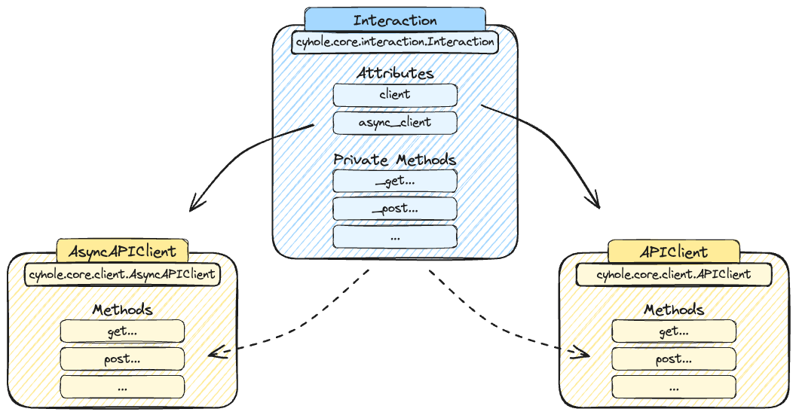

# Interactions

An `Interaction` is the most important element in the `cyhole` library because it is in charge to perform all the requests to an external API system. 
As a conseguence, every external API implemented in `cyhole` has its own dedicated class that inherits from [`cyhole.core.interaction.Interaction`](../development/core/interaction.md#cyhole.core.interaction.Interaction) class. 

The structure of a standard `Interaction` is described by the image below:

<figure markdown="span">
  
  <figcaption>Image created using <a href="https://excalidraw.com/">Excalidraw</a></figcaption>
</figure>

Inside an `Interaction` there are two attributes identifying the clients responsable to perform the API calls:

- `client`: object used for **synchronous** logic calls. This attribute is an object created by a class that inherits from [`cyhole.core.client.APIClient`](../development/core/client.md#cyhole.core.client.APIClient).
- `async_client`: object used for **asynchronous** logic calls. This attribute is an object created by a class that inherits from [`cyhole.core.client.AsyncAPIClient`](../development/core/client.md#cyhole.core.client.AsyncAPIClient).

By looking to the image above, it is possibile to notice that the `Interaction` class has also a set of **private** methods, one for each implemented endpoint. All these methods are then also available in `client` and `async_client` to be used.

The idea beyond this architecture is to minimise the code repetition, every endopoint is identified by a **private** method inside `Interaction` class, and this method has all the required logic to hendle the dedicated API endopint call. In addition, the method can be executed in `sync` or `async` mode; for this reason the clients inside the interaction have implemented the corresponding method in **non-private** mode to be executed with the desired logic.

## Example

Consider the [`Jupiter`](jupiter/interaction.md#cyhole.jupiter.Jupiter) interaction and its GET endpoint **Price**.

The main class inherits from [`Interaction`](../development/core/interaction.md#cyhole.core.interaction.Interaction) class and it has:

- `client`: object created by [`JupiterClient`](jupiter/client.md#cyhole.jupiter.client.JupiterClient) class that inherits from [`APIClient`](../development/core/client.md#cyhole.core.client.APIClient).
- `async_client`: object created by [`JupiterAsyncClient`](jupiter/client.md#cyhole.jupiter.client.JupiterAsyncClient) class that inherits from [`AsyncAPIClient`](../development/core/client.md#cyhole.core.client.AsyncAPIClient).

The GET endopint is available as:

- [`Jupiter._get_price`](jupiter/interaction.md#cyhole.jupiter.Jupiter._get_price): **private** version of the endpoint with all the logic.
- [`JupiterClient.get_price`](jupiter/client.md#cyhole.jupiter.client.JupiterClient.get_price): **synchronous** logic calls.
- [`JupiterAsyncClient.get_price`](jupiter/client.md#cyhole.jupiter.client.JupiterAsyncClient.get_price): **asynchronous** logic calls.